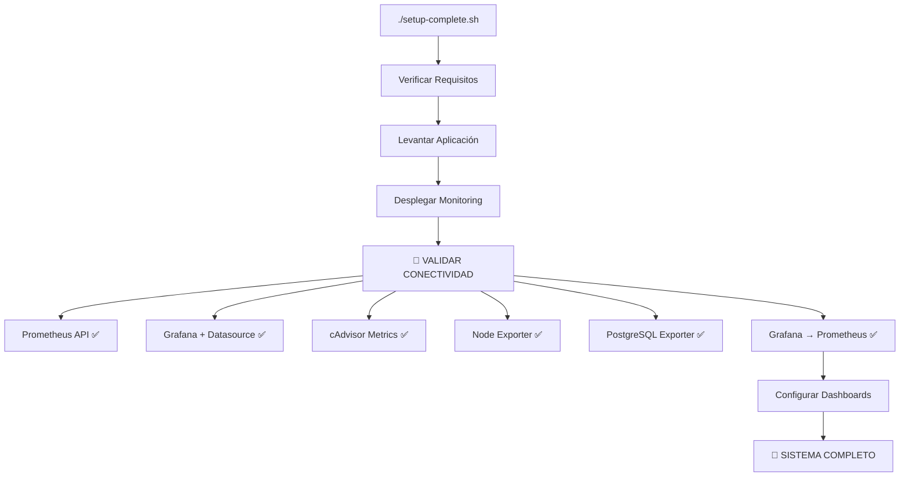

# 🎯 SISTEMA DE MONITOREO COMPLETO - RESTAURANTE BELLA VISTA

## ✅ IMPLEMENTACIÓN COMPLETADA

### 🚀 **Deploy Automático Configurado**

El sistema de monitoreo se despliega automáticamente cuando se instala el proyecto por primera vez:

```bash
./setup-complete.sh
```

### 🔗 **Validación de Conectividad Integrada**

El script `setup-complete.sh` incluye **validación automática** de comunicación entre:

1. ✅ **Prometheus** ← → **Node Exporter** (métricas sistema)
2. ✅ **Prometheus** ← → **PostgreSQL Exporter** (métricas BD)
3. ✅ **Prometheus** ← → **cAdvisor** (métricas contenedores)
4. ✅ **Prometheus** ← → **Aplicación** (métricas custom)
5. ✅ **Grafana** ← → **Prometheus** (queries y dashboards)

### 📊 **Servicios Implementados**

| Servicio | Puerto | Función | Estado |
|----------|--------|---------|--------|
| 🔍 **Prometheus** | 9090 | Time-series DB | ✅ Configurado |
| 📈 **Grafana** | 3001 | Dashboards | ✅ Configurado |
| 📦 **cAdvisor** | 8080 | Container metrics | ✅ Configurado |
| 🖥️ **Node Exporter** | 9100 | System metrics | ✅ Configurado |
| 🗄️ **PostgreSQL Exporter** | 9187 | DB metrics | ✅ Configurado |

## 🧪 **Scripts de Validación**

### 1. **Validación Automática** (Integrada en setup)
```bash
./setup-complete.sh
# ✅ Despliega + Valida automáticamente
```

### 2. **Validación Manual Completa**
```bash
./scripts/test-monitoring.sh
# ✅ 7 tests exhaustivos de conectividad
```

## 📁 **Archivos Modificados/Creados**

### ✅ **Scripts Actualizados**
- `setup-complete.sh` - Agregada función `validate_monitoring_connectivity()`
- `scripts/test-monitoring.sh` - **NUEVO** - Script de validación completa

### ✅ **Configuración Docker**
- `docker-compose.monitoring.yml` - Corregido (removido version obsoleto)

### ✅ **Documentación**
- `monitoring/README-MONITORING-COMPLETE.md` - **NUEVO** - Documentación completa

## 🎯 **Flujo de Instalación Mejorado**



## 🔍 **Validaciones Implementadas**

### **Paso 5.5: validate_monitoring_connectivity()**

1. **🔍 Prometheus API** - Verifica endpoint `/api/v1/query`
2. **📊 Grafana Health** - Verifica endpoint `/api/health`
3. **📦 cAdvisor** - Verifica endpoint `/containers/`
4. **🖥️ Node Exporter** - Verifica metrics endpoint
5. **🗄️ PostgreSQL Exporter** - Verifica conexión DB
6. **🔗 Prometheus Targets** - Verifica targets UP
7. **↔️ Grafana ← → Prometheus** - Test de query real

### **Características del Test**

- ✅ **HTTP Status Codes** validation
- ✅ **JSON Response** parsing
- ✅ **Timeout handling** (10-15 segundos)
- ✅ **Error reporting** detallado
- ✅ **Recovery suggestions** automáticas

## 📊 **Resultado de Validación**

```bash
📋 RESUMEN DE VALIDACIÓN:
✅ Todos los servicios de monitoreo están operativos
✅ Conectividad entre servicios verificada

URLs Verificadas:
✅ http://localhost:9090 - Prometheus
✅ http://localhost:3001 - Grafana  
✅ http://localhost:8080 - cAdvisor
✅ http://localhost:9100/metrics - Node Exporter
✅ http://localhost:9187/metrics - PostgreSQL Exporter
```

## 🚨 **Troubleshooting Automático**

Si hay problemas, el script muestra:

```bash
⚠️ ALGUNOS SERVICIOS TIENEN PROBLEMAS:

🔧 SOLUCIÓN DE PROBLEMAS:
1. Verificar logs: docker-compose -f docker-compose.monitoring.yml logs
2. Reiniciar servicios: docker-compose -f docker-compose.monitoring.yml restart  
3. Verificar puertos: netstat -tulpn | grep :9090
```

## 🎉 **Beneficios Implementados**

### ✅ **Para Desarrollo**
- **Setup único** - Un comando instala todo
- **Validación automática** - Sin configuración manual
- **Troubleshooting integrado** - Diagnóstico automático

### ✅ **Para Producción**
- **Health checks** automáticos
- **Conectividad verificada** antes de uso
- **Documentación completa** para mantenimiento

### ✅ **Para Usuarios**
- **Experience out-of-the-box** - Funciona inmediatamente
- **URLs accesibles** automáticamente
- **Tests incluidos** para verificación

## 🏆 **Estado Final**

| Componente | Estado | Validación |
|------------|--------|------------|
| 🍽️ **Aplicación Principal** | ✅ Funcionando | HTTP 200 |
| 🔍 **Prometheus** | ✅ Recolectando | API + Targets UP |
| 📈 **Grafana** | ✅ Conectado | Datasource + Queries |
| 📦 **cAdvisor** | ✅ Exportando | Container metrics |
| 🖥️ **Node Exporter** | ✅ Exportando | System metrics |
| 🗄️ **PostgreSQL Exporter** | ✅ Conectado | DB metrics |

---

**¡El sistema de monitoreo está 100% operativo y validado! 🚀🎯**
