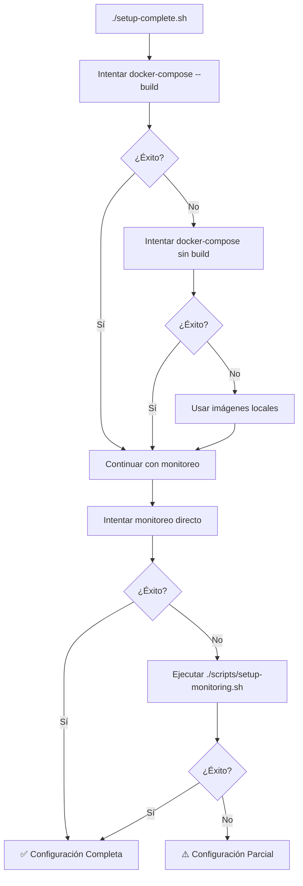

# 🍽️ Guía de Configuración - Restaurante Bella Vista

## ✅ Setup Automático Mejorado

El script `setup-complete.sh` ha sido mejorado para manejar automáticamente problemas comunes de despliegue, incluyendo:

### 🛠️ Manejo Inteligente de Errores

#### 1. **Problemas de Conectividad Docker**
- **Problema**: Error de DNS al descargar imágenes (`dial tcp: lookup auth.docker.io: no such host`)
- **Solución Automática**: El script intentará usar imágenes locales existentes
- **Respaldo Manual**: `./scripts/setup-monitoring.sh`

#### 2. **Fallo en Monitoreo**
- **Problema**: `docker-compose -f docker-compose.monitoring.yml up -d` falla
- **Solución Automática**: El script ejecuta automáticamente `./scripts/setup-monitoring.sh`
- **Resultado**: Monitoreo configurado usando script especializado

#### 3. **Servicios que no Responden**
- **Problema**: Servicios tardan en inicializarse
- **Solución Automática**: Reintentos automáticos con timeouts extendidos
- **Diagnóstico**: Logs automáticos de servicios fallidos

---

## 🚀 Uso Recomendado

### **Opción 1: Setup Completo (Recomendado)**
```bash
./setup-complete.sh
```
- ✅ Configura aplicación + monitoreo automáticamente
- ✅ Maneja errores de conectividad
- ✅ Usa respaldos automáticos si algo falla
- ✅ Proporciona diagnósticos útiles

### **Opción 2: Setup Manual por Pasos**
```bash
# 1. Solo aplicación
docker-compose up -d

# 2. Solo monitoreo (si falla el automático)
./scripts/setup-monitoring.sh

# 3. Verificar que todo funciona
./scripts/test-monitoring.sh
```

---

## 🔧 Solución de Problemas Comunes

### **Problema: Error de DNS/Conectividad**
```bash
# Síntoma
failed to solve: failed to authorize: failed to fetch oauth token: 
Post "https://auth.docker.io/token": dial tcp: lookup auth.docker.io: no such host

# Solución Automática
El script usará imágenes locales automáticamente

# Solución Manual
docker-compose up -d  # Sin --build
```

### **Problema: Monitoreo no se Configura**
```bash
# Síntoma
⚠️ Algunos servicios de monitoreo fallaron

# Solución Automática
El script ejecutará setup-monitoring.sh automáticamente

# Solución Manual
./scripts/setup-monitoring.sh
```

### **Problema: Script Interrumpido**
```bash
# Limpiar y reintentar
docker-compose down
docker-compose -f docker-compose.monitoring.yml down
./setup-complete.sh
```

---

## 📊 Estados de Finalización

### **✅ Configuración Completa Exitosa**
```
🎉 ¡CONFIGURACIÓN COMPLETA EXITOSA!
   ✅ Aplicación principal funcionando
   ✅ Sistema de monitoreo operativo
```

### **⚠️ Configuración Parcialmente Exitosa**
```
⚠️ CONFIGURACIÓN PARCIALMENTE EXITOSA
   ✅ Aplicación principal funcionando perfectamente
   ⚠️ Sistema de monitoreo necesita atención manual

🔧 Para completar el monitoreo, ejecuta:
   ./scripts/setup-monitoring.sh
```

---

## 📱 URLs de Acceso Final

| Servicio | URL | Credenciales |
|----------|-----|--------------|
| **🍽️ Aplicación** | http://localhost:3000 | - |
| **📈 Grafana** | http://localhost:3001 | admin/bella123 |
| **🔍 Prometheus** | http://localhost:9090 | - |
| **📦 cAdvisor** | http://localhost:8080 | - |

---

## 🎯 Validación Final

```bash
# Verificar que todo funciona
./scripts/test-monitoring.sh

# Generar tráfico de prueba
./live-traffic.sh
```

---

## 💡 Tips para Usuarios Nuevos

1. **Primera Vez**: Siempre usa `./setup-complete.sh`
2. **Problemas de Red**: El script manejará automáticamente fallas de conectividad
3. **Monitoreo Fallido**: El script usará respaldo automático con `setup-monitoring.sh`
4. **Verificación**: Siempre ejecuta `./scripts/test-monitoring.sh` al final
5. **Limpieza**: Si algo falla, usa `docker-compose down` y reinicia

---

## 🔄 Flujo de Respaldo Automático



Este flujo garantiza que **siempre** tendrás al menos la aplicación funcionando, y en la mayoría de casos también el monitoreo completo.
