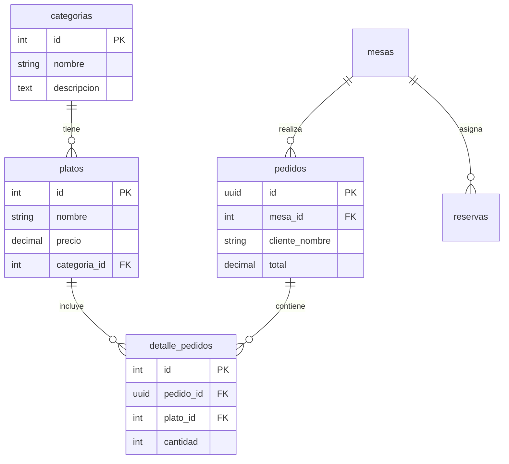

# 🗄️ Base de Datos PostgreSQL - Documentación

## 📋 Información General

- **SGBD**: PostgreSQL 15 Alpine
- **Base de Datos**: `bella_vista`
- **Usuario**: `restaurante`
- **Puerto**: 5432
- **Estado**: ✅ Activo con Health Check

## 🏗️ Arquitectura de Datos

```
PostgreSQL Container
├── Database: bella_vista
├── User: restaurante
├── Encoding: UTF-8
└── Extensions: uuid-ossp
```

## 📊 Esquema de Base de Datos

### 🏷️ Tablas Principales

#### 1. **categorias**
Gestión de categorías del menú

| Campo | Tipo | Restricciones | Descripción |
|-------|------|---------------|-------------|
| `id` | SERIAL | PRIMARY KEY | Identificador único |
| `nombre` | VARCHAR(100) | NOT NULL, UNIQUE | Nombre de la categoría |
| `descripcion` | TEXT | - | Descripción detallada |
| `activo` | BOOLEAN | DEFAULT true | Estado activo/inactivo |
| `created_at` | TIMESTAMP | DEFAULT NOW() | Fecha de creación |
| `updated_at` | TIMESTAMP | DEFAULT NOW() | Última actualización |

#### 2. **platos**
Información de los platos del menú

| Campo | Tipo | Restricciones | Descripción |
|-------|------|---------------|-------------|
| `id` | SERIAL | PRIMARY KEY | Identificador único |
| `nombre` | VARCHAR(200) | NOT NULL | Nombre del plato |
| `descripcion` | TEXT | - | Descripción del plato |
| `precio` | DECIMAL(10,2) | NOT NULL | Precio en euros |
| `categoria_id` | INTEGER | FK → categorias(id) | Categoría del plato |
| `imagen_url` | VARCHAR(500) | - | URL de la imagen |
| `disponible` | BOOLEAN | DEFAULT true | Disponibilidad |
| `tiempo_preparacion` | INTEGER | DEFAULT 15 | Tiempo en minutos |
| `ingredientes` | TEXT[] | - | Array de ingredientes |
| `alergenos` | TEXT[] | - | Array de alérgenos |
| `vegetariano` | BOOLEAN | DEFAULT false | Es vegetariano |
| `vegano` | BOOLEAN | DEFAULT false | Es vegano |
| `sin_gluten` | BOOLEAN | DEFAULT false | Sin gluten |
| `created_at` | TIMESTAMP | DEFAULT NOW() | Fecha de creación |
| `updated_at` | TIMESTAMP | DEFAULT NOW() | Última actualización |

#### 3. **mesas**
Configuración de mesas del restaurante

| Campo | Tipo | Restricciones | Descripción |
|-------|------|---------------|-------------|
| `id` | SERIAL | PRIMARY KEY | Identificador único |
| `numero` | INTEGER | NOT NULL, UNIQUE | Número de mesa |
| `capacidad` | INTEGER | NOT NULL | Capacidad de personas |
| `ubicacion` | VARCHAR(100) | - | Ubicación (terraza, interior, privada) |
| `activa` | BOOLEAN | DEFAULT true | Estado activo/inactivo |
| `created_at` | TIMESTAMP | DEFAULT NOW() | Fecha de creación |

#### 4. **pedidos**
Gestión de pedidos de clientes

| Campo | Tipo | Restricciones | Descripción |
|-------|------|---------------|-------------|
| `id` | UUID | PRIMARY KEY | Identificador único (UUID) |
| `mesa_id` | INTEGER | FK → mesas(id) | Mesa asociada |
| `cliente_nombre` | VARCHAR(200) | - | Nombre del cliente |
| `cliente_telefono` | VARCHAR(20) | - | Teléfono del cliente |
| `estado` | VARCHAR(50) | DEFAULT 'pendiente' | Estado del pedido |
| `total` | DECIMAL(10,2) | DEFAULT 0 | Total del pedido |
| `observaciones` | TEXT | - | Observaciones especiales |
| `tiempo_estimado` | INTEGER | - | Tiempo estimado en minutos |
| `created_at` | TIMESTAMP | DEFAULT NOW() | Fecha de creación |
| `updated_at` | TIMESTAMP | DEFAULT NOW() | Última actualización |

**Estados de Pedido**: `pendiente`, `preparando`, `listo`, `servido`, `pagado`, `cancelado`

#### 5. **detalle_pedidos**
Detalles específicos de cada pedido

| Campo | Tipo | Restricciones | Descripción |
|-------|------|---------------|-------------|
| `id` | SERIAL | PRIMARY KEY | Identificador único |
| `pedido_id` | UUID | FK → pedidos(id) CASCADE | Pedido asociado |
| `plato_id` | INTEGER | FK → platos(id) | Plato pedido |
| `cantidad` | INTEGER | NOT NULL, DEFAULT 1 | Cantidad solicitada |
| `precio_unitario` | DECIMAL(10,2) | NOT NULL | Precio al momento del pedido |
| `observaciones` | TEXT | - | Observaciones del plato |
| `created_at` | TIMESTAMP | DEFAULT NOW() | Fecha de creación |

#### 6. **reservas**
Sistema de reservas de mesas

| Campo | Tipo | Restricciones | Descripción |
|-------|------|---------------|-------------|
| `id` | UUID | PRIMARY KEY | Identificador único (UUID) |
| `cliente_nombre` | VARCHAR(200) | NOT NULL | Nombre del cliente |
| `cliente_telefono` | VARCHAR(20) | NOT NULL | Teléfono del cliente |
| `cliente_email` | VARCHAR(200) | - | Email del cliente |
| `fecha_reserva` | DATE | NOT NULL | Fecha de la reserva |
| `hora_reserva` | TIME | NOT NULL | Hora de la reserva |
| `num_personas` | INTEGER | NOT NULL | Número de personas |
| `mesa_id` | INTEGER | FK → mesas(id) | Mesa asignada |
| `estado` | VARCHAR(50) | DEFAULT 'confirmada' | Estado de la reserva |
| `observaciones` | TEXT | - | Observaciones especiales |
| `created_at` | TIMESTAMP | DEFAULT NOW() | Fecha de creación |
| `updated_at` | TIMESTAMP | DEFAULT NOW() | Última actualización |

**Estados de Reserva**: `pendiente`, `confirmada`, `cancelada`, `completada`

#### 7. **usuarios**
Gestión de usuarios del sistema administrativo

| Campo | Tipo | Restricciones | Descripción |
|-------|------|---------------|-------------|
| `id` | SERIAL | PRIMARY KEY | Identificador único |
| `username` | VARCHAR(100) | NOT NULL, UNIQUE | Nombre de usuario |
| `password_hash` | VARCHAR(255) | NOT NULL | Hash de la contraseña |
| `email` | VARCHAR(200) | UNIQUE | Email del usuario |
| `rol` | VARCHAR(50) | DEFAULT 'empleado' | Rol del usuario |
| `activo` | BOOLEAN | DEFAULT true | Estado activo/inactivo |
| `created_at` | TIMESTAMP | DEFAULT NOW() | Fecha de creación |
| `last_login` | TIMESTAMP | - | Último inicio de sesión |

**Roles disponibles**: `admin`, `gerente`, `empleado`, `cocinero`

## 🔗 Relaciones



## 📈 Índices de Performance

```sql
-- Índices principales para optimización
CREATE INDEX idx_platos_categoria ON platos(categoria_id);
CREATE INDEX idx_platos_disponible ON platos(disponible);
CREATE INDEX idx_pedidos_estado ON pedidos(estado);
CREATE INDEX idx_pedidos_mesa ON pedidos(mesa_id);
CREATE INDEX idx_reservas_fecha ON reservas(fecha_reserva);
CREATE INDEX idx_reservas_estado ON reservas(estado);
```

## 🔄 Triggers Automáticos

### Actualización de Timestamps
```sql
-- Función para actualizar updated_at automáticamente
CREATE OR REPLACE FUNCTION update_updated_at_column()
RETURNS TRIGGER AS $$
BEGIN
    NEW.updated_at = CURRENT_TIMESTAMP;
    RETURN NEW;
END;
$$ language 'plpgsql';

-- Triggers aplicados a:
- platos
- pedidos  
- reservas
```

## 📊 Datos de Ejemplo

### Categorías Predefinidas
- **Entrantes**: Deliciosos aperitivos para comenzar
- **Platos Principales**: Nuestras especialidades de la casa
- **Postres**: Dulces tentaciones para finalizar
- **Bebidas**: Refrescantes opciones para acompañar
- **Vinos**: Selección de vinos nacionales e internacionales

### Mesas Configuradas
- **8 mesas** con capacidades de 2, 4, 6 y 8 personas
- **Ubicaciones**: Interior, terraza y sala privada
- **Mesa privada**: Mesa 6 con capacidad para 8 personas

### Usuario Administrador
- **Username**: `admin`
- **Email**: `admin@bellavista.com`
- **Rol**: `admin`
- **Password**: `admin123` (cambiar en producción)

## 🐳 Configuración Docker

```yaml
postgres:
  image: postgres:15-alpine
  environment:
    POSTGRES_DB: bella_vista
    POSTGRES_USER: restaurante
    POSTGRES_PASSWORD: bella123
    POSTGRES_INITDB_ARGS: "--encoding=UTF-8"
  volumes:
    - postgres_data:/var/lib/postgresql/data
    - ./database/init-db.sql:/docker-entrypoint-initdb.d/init-db.sql
  healthcheck:
    test: ["CMD-SHELL", "pg_isready -U restaurante -d bella_vista"]
    interval: 10s
    timeout: 5s
    retries: 5
```

## 🔧 Consultas Comunes

### Obtener menú completo
```sql
SELECT 
    c.nombre as categoria,
    p.nombre as plato,
    p.descripcion,
    p.precio,
    p.vegetariano,
    p.sin_gluten
FROM platos p
JOIN categorias c ON p.categoria_id = c.id
WHERE p.disponible = true
ORDER BY c.nombre, p.nombre;
```

### Pedidos pendientes
```sql
SELECT 
    p.id,
    p.cliente_nombre,
    m.numero as mesa,
    p.total,
    p.estado,
    p.created_at
FROM pedidos p
JOIN mesas m ON p.mesa_id = m.id
WHERE p.estado IN ('pendiente', 'preparando')
ORDER BY p.created_at;
```

### Reservas del día
```sql
SELECT 
    r.cliente_nombre,
    r.hora_reserva,
    r.num_personas,
    m.numero as mesa,
    r.estado
FROM reservas r
LEFT JOIN mesas m ON r.mesa_id = m.id
WHERE r.fecha_reserva = CURRENT_DATE
ORDER BY r.hora_reserva;
```

## 🔐 Seguridad

### Consideraciones Implementadas
- ✅ **Contraseñas hasheadas** con bcrypt
- ✅ **UUIDs** para pedidos y reservas
- ✅ **Relaciones con CASCADE** para integridad
- ✅ **Validaciones de tipo** en columnas críticas

### Pendientes de Implementar
- 🔒 **Row Level Security (RLS)**
- 🔑 **Rotación de contraseñas**
- 📊 **Auditoría de cambios**
- 🛡️ **Encriptación de datos sensibles**

## 📈 Monitoreo

### Health Checks
- ✅ Verificación automática cada 10 segundos
- ✅ Timeout de 5 segundos
- ✅ 5 reintentos antes de marcar como unhealthy

### Métricas Sugeridas
- 📊 Número de conexiones activas
- ⏱️ Tiempo de respuesta de consultas
- 💾 Uso de almacenamiento
- 🔄 Frecuencia de operaciones CRUD

## 🚀 Optimizaciones Futuras

### Performance
- 📈 **Particionado** de tablas por fecha
- 🗃️ **Archivado** de pedidos antiguos
- 💾 **Caché** de consultas frecuentes
- 📊 **Análisis de consultas** lentas

### Funcionalidades
- 🔔 **Notificaciones** en tiempo real
- 📊 **Analytics** de ventas
- 🎯 **Recomendaciones** personalizadas
- 🌐 **Replicación** para alta disponibilidad

---

**Última actualización**: 13 de Julio, 2025  
**Versión del esquema**: 1.0  
**Mantenido por**: Equipo de Desarrollo Bella Vista
